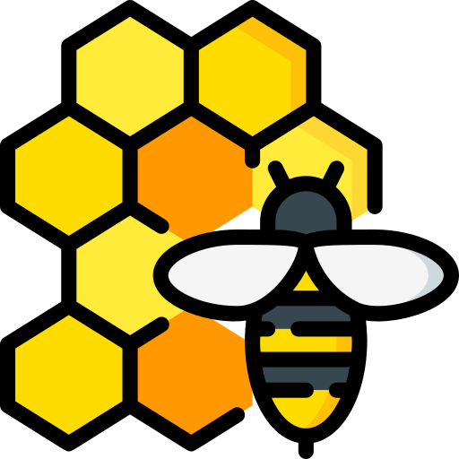

# 🐝 Smart Bee - Graduation Project (Bachelor's Degree)

<p align="center">
  
</p>

---

## 📝 Project Overview
**Smart Bee** is an intelligent beehive monitoring system based on Internet of Things (IoT) technologies. This application was developed as a **graduation project for a Bachelor's degree in Computer Science**. The system aims to enable beekeepers to monitor hive conditions (temperature, humidity) remotely and in real-time, helping to improve production and maintain bee health.

## 🚀 Key Features
*   **📊 Live Monitoring:** Continuous tracking of temperature and humidity via Firebase.
*   **🔔 Smart Alert System:** Instant notifications when critical changes occur in the hive environment.
*   **📶 Offline Support:** Data caching to ensure availability even when the connection is lost.
*   **🛡️ Administrative Dashboard:** A dedicated interface for administrators to manage hives and users.
*   **🌗 Dark/Light Mode:** Full support for dark and light themes.
*   **🌍 Multilingual:** Support for both Arabic and English.

## 🛠️ Tech Stack
*   **Framework:** [Flutter](https://flutter.dev)
*   **Backend:** [Firebase Realtime Database](https://firebase.google.com)
*   **Notifications:** Firebase Cloud Messaging (FCM)
*   **Language:** Dart

## 📱 Installation & Setup

### Prerequisites
- Install [Flutter SDK](https://docs.flutter.dev/get-started/install) on your machine.
- Development environment (Android Studio or VS Code).
- A [Firebase](https://console.firebase.google.com/) project.

### ⚙️ Configuration

#### 1. Firebase Setup
*   **Mobile App:**
    *   Create a Firebase project.
    *   Download `google-services.json` and place it in `android/app/`.
    *   The app uses the default initialization from this file.
*   **ESP32 (Firmware):**
    *   Open `firmware/esp32/esp32_sensor.ino`.
    *   Update `FIREBASE_HOST` with your project URL (e.g., `your-project.firebasedatabase.app`).
    *   Update `FIREBASE_AUTH` with your Database Secret (found in Firebase Console Settings -> Service Accounts -> Database Secrets).

#### 2. Google Sheets Integration
*   Set up a Google Sheet and a Google Apps Script to receive data.
*   **ESP32 (Firmware):**
    *   In `firmware/esp32/esp32_sensor.ino`, update `GOOGLE_SCRIPT_URL` with your deployed script URL.

### 🔔 Push Notifications Setup
To enable the application to receive notifications:
1.  **Firebase Console:** Go to your project in the Firebase Console and enable **Cloud Messaging**.
2.  **Configuration File:** Ensure the `google-services.json` file is correctly placed in `android/app/`.
3.  **Permissions:** The app will request notification permissions on the first run.
4.  **Testing:** You can send a test notification from the Firebase "Cloud Messaging" tab to verify.

### Installation Steps
1.  **Clone the repository:**
    ```bash
    git clone https://github.com/abdxnour/smart_bee.git
    ```
2.  **Navigate to the project folder:**
    ```bash
    cd smart_bee
    ```
3.  **Download dependencies:**
    ```bash
    flutter pub get
    ```
4.  **Run the application:**
    Ensure an Android device is connected or an emulator is running, then execute:
    ```bash
    flutter run
    ```

## 🎓 Academic Context
This application was developed as a core requirement for a Bachelor's degree.

**Developer:** [CHELALI SLIMANE ABDENNOUR](https://www.linkedin.com/in/slimane-abdennour-chelali-b2215938a)  
**Supervised by:** [Dr. LAIREDJ Aboubaker Saddik](https://www.linkedin.com/in/aboubaker-saddik-lairedj-01a836138) ([lairedjboubakerdz@gmail.com](mailto:lairedjboubakerdz@gmail.com))  
**Academic Year:** 2025 - 2026  
**Contact:** [abdxnour@gmail.com](mailto:abdxnour@gmail.com)

---

## 📄 License
This project is intended for educational and research purposes. All rights reserved © 2025.
